# nginx 简介

> 1. 什么是nginx

+ Nginx 是一个高性能的`HTTP`和`反向代理`web服务器
+ Nginx 转为性能优化而开发的,性能是其最重要的考量,事实上非常注重效率,能经受高负载的考验,有报告表明能支持高达50000个并发连接数

> 2. 特点

+ 其特点是占有内存少，并发能力强，事实上nginx的并发能力在同类型的网页服务器中表现较好
+ Nginx 支持热部署,他的启动特别容容易,并且几乎可以做到7*24不间断运行,即使运行数个月也不需要重新启动,你还能在不间断服务的情况下,对软件版本进行升级

> 3. 反向代理

- 正向代理: 在客户端配置代理服务器,通过代理服务器进行互联网访问


- 反向代理
  - 反向代理,其实客户端对代理是无感知的,因为客户端不需要任何配置就可以访问,我们只需要将请求发送到反向代理服务器,由反向代理服务器去选择目标服务器获取数据后,在返回给客户端,此时反向代理服务器和目标服务器对外就是一个服务器,暴露的是代理服务器地址,隐藏真实服务器IP地址

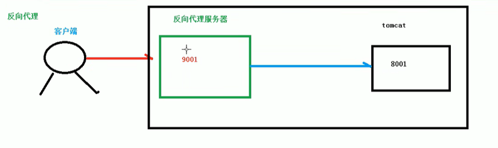
     
> 4. 负载均衡  

- 客户端发送多个请求到服务器,服务器处理请求,有一些可能要与数据库进行交互,服务器处理完毕后,再将结果返回给客户端
- 这种架构模式对于早期的系统相对单一,并发请求相对较少的情况是比较合适的,成本也低,但是随着信息数量的不断增长,访问量和数据量飞速增长,以及系统业务的复杂度增加,这种架构会造成服务器响应客户端的请求日益缓慢,并发量特别大的时候,还容易造成服务器直接崩溃,很明显这是由服务器行性能的瓶颈造成的问题,那么如何解释这种情况呢
- 单个服务器解决不了,我们增加服务器数量,然后将请求分发到各个服务器上,将原先请求集中到单个服务器上的情况改为将请求分发到多个服务器上,将负载分发到不同的服务器,也就是我们所说的负载均衡

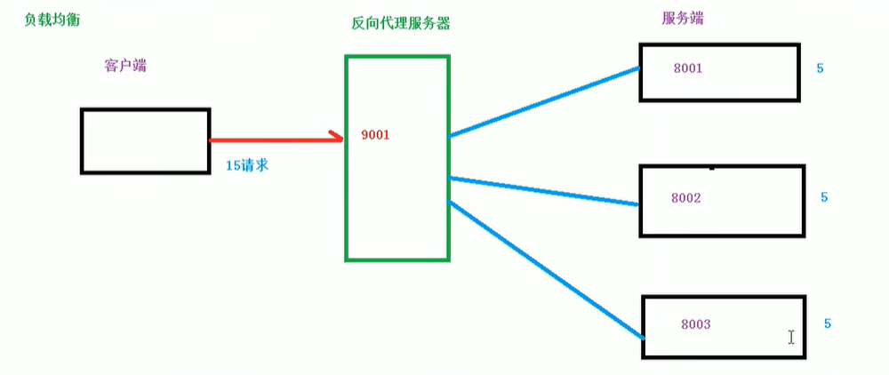

> 5. 动静分离

- 为了加快网站的解析速度,可以把动态页面和静态页面由不同的服务器来解析,加快解析速度,降低原来单个服务器的压力

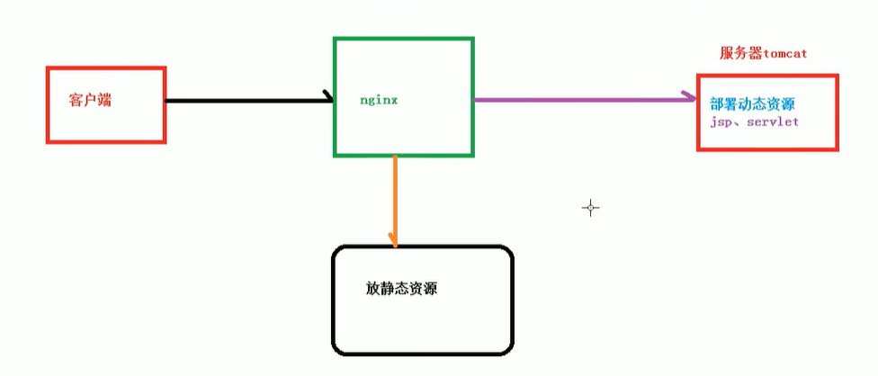

# nginx 的安装

> 1.使用远程连接工具连接linux操作系统
> 2.nginx相关素材
> > pcre-8.37.tar.gz
> > opnssl-1.0.1t.tar.gz
> > zlib.1.2.3.tar.gz
> > nginx.1.11.1.tar.gz
> 3.安装nginx  
> > [nginx安装](https://zhuanlan.zhihu.com/p/83890573)  
> > [开放80端口](https://blog.csdn.net/weixin_38750084/article/details/90387056)

# nginx 操作的常用命令

> 1.使用nginx操作命令前提条件 必须进入nginx的目录
> `cd /usr/local/nginx/sbin/` 
>  
> 2.查看nginx的版本号   
> `./nginx -v`  
> 
> 3.启动nginx  
> `./nginx`  
> 
> 4.关闭nginx  
> `./nginx -s stop`  
> 
> 5.重新加载nginx  
> `./nginx -s reload`

# nginx 配置文件

> 1. nginx配置文件的位置

`/usr/local/nginx/conf/nginx.conf` 

 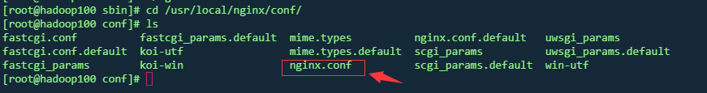

> 2. nginx配置文件组成

1. nginx配置文件有三部分组成

- 第一部分 全局块  
  - 从配置文件到 events 块之间的内容,主要会设置一些影响nginx服务器整体运行的配置命令  
  比如:  
  `worker_processes  1;`  
  这是Nginx服务器并发处理服务的相关配置,worker_processes值越大,可以支持的并发处理量也越多,但是会受到硬件软件等设备的制约  
  
- 第二部分 events块  
  - events 块设涉及的指令主要影响Nginx服务器于用户的网络连接  
  比如:  
  `worker_connections  1024;`  
  标识每个work process支持的最大连接数为1024
- 
- 第三部分 http块
  - 这算是 Nginx 服务器配置中最频繁的部分,代理,缓存和日志定义等绝大多多数功能和第三方模块的配置都在这里
  - 需要注意的是: http块也可以包括http全局块,server块
  - 1.http全局块
    - http全局块配置的指令包括文件引入,MIME-TYPE定义,日志自定义,连接超时事件,单连链接请求上限等  
```
   http {
    include       mime.types;
    default_type  application/octet-stream;

    #log_format  main  '$remote_addr - $remote_user [$time_local] "$request" '
    #                  '$status $body_bytes_sent "$http_referer" '
    #                  '"$http_user_agent" "$http_x_forwarded_for"';

    #access_log  logs/access.log  main;

    sendfile        on;
    #tcp_nopush     on;

    #keepalive_timeout  0;
    keepalive_timeout  65;

    #gzip  on;
     ...
     }
```
- 
  - server 块  
    - 这块和虚拟主机有密切关系,虚拟主机从用户角度看,和一台独立的硬件主机是完全一样的,该技术的产生是为了节省互联网服务器硬件的成本
    - 每个 http 块可以包括多个 server 块,而每个 server 块相当于一个虚拟主机
    - 而每个 server 块也可分为全局 server 块,以及可以同时包含多个 location 块
    -  1.全局server块


# Nginx 配置实例-反向代理实例1

```
  1.实现效果
    1) 打开浏览器,再浏览器输入地址,www.123.com,跳转Linux系统tomcat主页面中
  2.准备工作
    1) 再linux系统安装tomcat,使用默认端口8080
    *tomcat安装文件放到linux系统中,解压
    *进入tomcat的bin目录中 ./startup.sh启动tomcat服务器
    2)对外开放访问的端口
    firewall-cmd --zone=public --add-port=8080/tcp --permanent 开放8080端口
    firewall-cmd --list-ports 查看已开启的端口
     firewall-cmd --reload  重启防火墙
     
     浏览器访问虚拟机IP:8080
     
    3. 配置host文件
     路径 : C:\Windows\System32\drivers\etc
      在hosts文件中追加内容 :192.168.5.100 www.123.com
      
    4. 在nginx进行请求转发的配置(反向代理)
    
     
```

访问过程

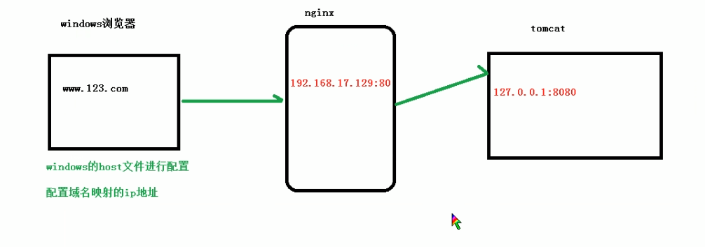

最终效果

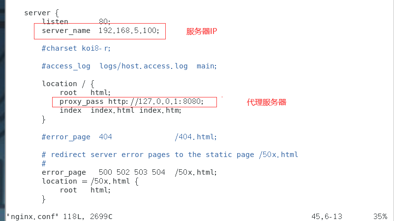

# Nginx配置实例-反向代理实例2

```
  1.实现效果:
  通过nginx反向代理,根据访问的路径跳转到不同端口的服务器中
  nginx监听端口为9001
  
  访问 http://127.0.0.1:9001/edu/直接跳转到127.0.0.1:8081
  访问 http://127.0.0.1:9001/vod/直接跳转到127.0.0.1:8082
  
  2.准备工作
  1)准备两个tomcat服务器,一个8080端口,一个8081端口
  

```

配置文件

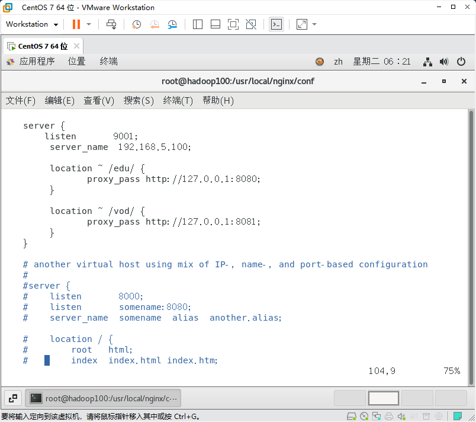


# location指令说明  
改指令用于匹配URL  
语法如下  
```
location [ = | ~ | ~* | ^~] uri {

}

1. = : 用于不含正则表达的uri浅,要求i请求字符串与uri严格匹配,如果匹配成功
就停止继续向下搜索并立即处理该请求

2. ~ : 用于表示uri包含正则表达式,并且区分大小写

3. ~* : 用于表示ur包含正则表达式,并且不区分大小写

4. ^~ : 用于不含正则表达式的uri前,要求Nginx服务器找到标识uri和请求字符串匹配度最高的location后,
立即使用此location处理请求,而不再使用location块中的正则url和请求字符串做匹配

注意:如果uri包含正则表达式,则必须要有~或者~*标识


```
# Nginx 配置实例-负载均衡

```
  实现效果
1) 浏览器地址输入 192,168.5.100/edu/a.html,负载均衡效果,平均8080,和8081

2) 在nginx.conf中进行配置

```
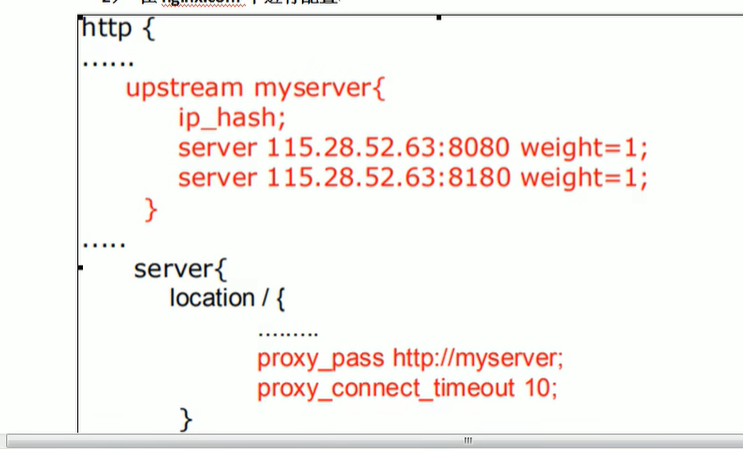

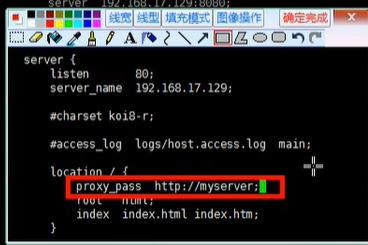


> 随着互联网的爆炸性增长,负载均衡已经不再是一个很陌生的话题,顾名思义,负载均衡即是将负载分摊到不同的服务单元,即保证服务的可用性,用保证响应足够快,给用户很好的体验.
> 快速增长的访问量和数据量催生了各式各样的负载均衡产品,很多专业的负载均衡硬件提供了很好的功能,但却价格不菲,这使得负载均衡软件大受欢迎
> nginx就是其中一个,在linux下有nginx,lvs,haproxy等等服务可以提供负载均衡服务,而且Nginx提供了几种分配方式(策略)
> 
> 1.轮询(默认)  
> 每次请求按时间顺序逐一分配到不同的后端服务器,如果后端服务器down掉,能自动剔除
> 
> 2.weight  
> weight代表权重,默认为1.权重越高分配的客户端越多
> 指定轮询记录,weight和访问比率成正比,用于后端服务器性能不均的情况 例如:  
> 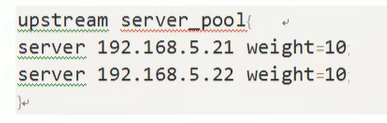
> 
> 3.ip_hash
> 每个请求按访问ip的hash结果分配,这样每个访客固定访问一个后端服务器,可以解决session的问题,例如:
> 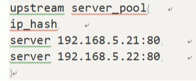
> 
> 4.fair(第三方)  
> 按后端服务器的响应时间来分配请求,响应时间段的优先分配
> 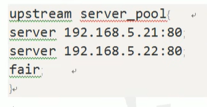
> 
> 

# Nginx 配置实例-动静分离

1. 什么是动静分离  
- Nginx 动静分离简单来说就是把动态根静态请求分开,不能理解为只是单纯把动态页面和静态页面物理分离,
- 严格意义来说应该是动态请求根静态请求分开,可以理解成使用Nginx处理静态也买你,Tomcat处理动态也买你,动静分离从目前实现角度来讲,大致分为两种
- 一种是纯粹把静态我呢见独立成单独的域名,放在独立的服务器上,也是目前主流推崇的方案:
- 另一种方法就是动态根静态文件混合在一起发布,通过nginx来分开 
- 通过location指定不同的后缀名实现不同的请求转发,通过expires参数设置可以使浏览器缓存过期时间,减少与服务器之间的请求和流量,具体expires定义,是给一个资源设定一个过期时间,也就是说无需去服务器端验证,
- 直接通过浏览器自身确认是否过期即可,所以不会产生额外的流量,此种方法非常适合不经常变动的资源(如果经常更新的文件,不建议使用expires来缓存),这里设置3d,标识在三天之内访问这个url,发送一个请求,比对服务器该文件最后更新时间没有变化
- 则不会从服务器抓取,返回状态码304,如果有修改,则直接从服务器端重新下载,返回状态码200
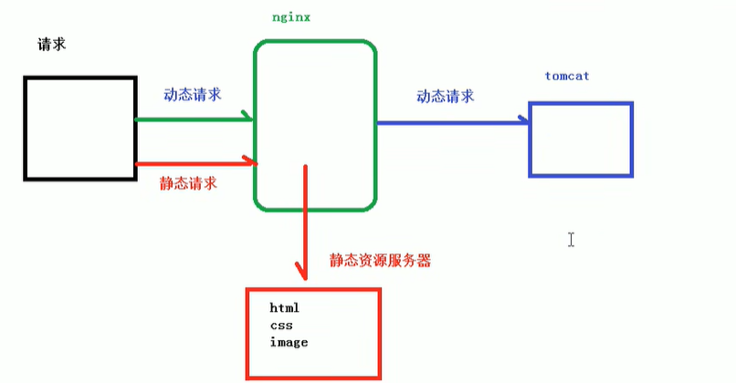

2. 具体配置

1) 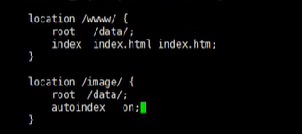

3.最终测试
1) 浏览器中输入地址 http://xxxx/image/01.jpg
2) 配置问价autoindex on 列出文件夹的位置


# Nginx 配置高可用的集群

nginx可能会宕机

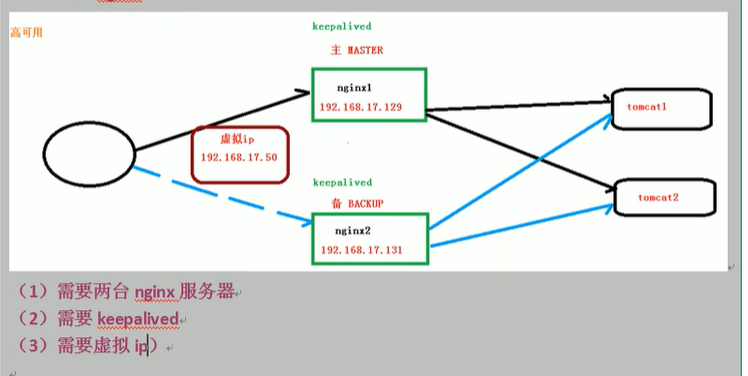

2. 配置高可用的准备工作
  1) 需要两个虚拟机的环境
  2) 两台服务器安装nginx
  3) 两台服务器安装keepalived `yum install keepalived -y`
  4) 安装keepalived后,会在etc里面生成目录keepalived,有文件keepalived.conf
  5) 命令: `yum -y install make zlib zlib-devel gcc-c++ libtool openssl openssl-devel`


3. 完成高可用配置
   1. 配置/etc/下的/keepalived/keepalived.conf文件
   2. 在/usr/local/src添加检测脚本
   ```
     #!/bin/bash
    counter=$(ps -C nginx |grep -v PID |wc -l)
    if [ $counter == 0 ];then     
      /usr/local/nginx/sbin/nginx
    sleep 30  
       counter=$(ps -C nginx |grep -v PID |wc -l)
    if [ $counter == 0 ];then  
         systemctl stop keepalived
        fi
    fi
      
   ```
   
   1) 把两台服务器启动
      1. 启动keepalived: `systemctl start keepalived.service`

   


