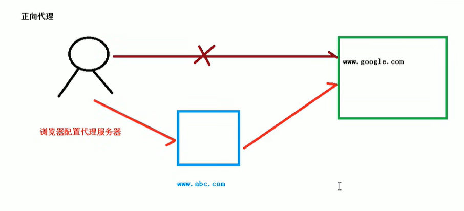

# nginx 简介

> 1. 什么是nginx

+ Nginx 是一个高性能的`HTTP`和`反向代理`web服务器
+ Nginx 转为性能优化而开发的,性能是其最重要的考量,事实上非常注重效率,能经受高负载的考验,有报告表明能支持高达50000个并发连接数

> 2. 特点

+ 其特点是占有内存少，并发能力强，事实上nginx的并发能力在同类型的网页服务器中表现较好
+ Nginx 支持热部署,他的启动特别容容易,并且几乎可以做到7*24不间断运行,即使运行数个月也不需要重新启动,你还能在不间断服务的情况下,对软件版本进行升级

> 3. 反向代理

- 正向代理: 在客户端配置代理服务器,通过代理服务器进行互联网访问

- 反向代理
  - 反向代理,其实客户端对代理是无感知的,因为客户端不需要任何配置就可以访问,我们只需要将请求发送到反向代理服务器,由反向代理服务器去选择目标服务器获取数据后,在返回给客户端,此时反向代理服务器和目标服务器对外就是一个服务器,暴露的是代理服务器地址,隐藏真实服务器IP地址

     
> 4. 负载均衡  

- 客户端发送多个请求到服务器,服务器处理请求,有一些可能要与数据库进行交互,服务器处理完毕后,再将结果返回给客户端
- 这种架构模式对于早期的系统相对单一,并发请求相对较少的情况是比较合适的,成本也低,但是随着信息数量的不断增长,访问量和数据量飞速增长,以及系统业务的复杂度增加,这种架构会造成服务器响应客户端的请求日益缓慢,并发量特别大的时候,还容易造成服务器直接崩溃,很明显这是由服务器行性能的瓶颈造成的问题,那么如何解释这种情况呢
- 

> 5. 动静分离

